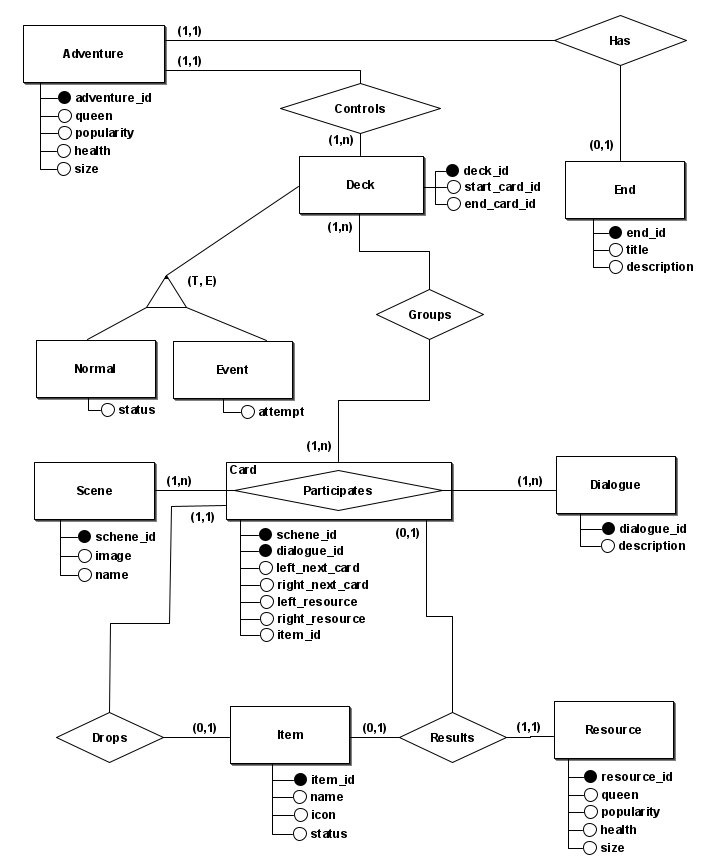

# **Diagrama Entidade-Relacionamento (DER)**

## **Introdução**
O **Diagrama Entidade-Relacionamento (DER)** é uma representação gráfica de um modelo de dados que descreve as entidades e os relacionamentos entre elas. Ele é uma ferramenta visual que ajuda a entender a estrutura de um banco de dados e a identificar as relações entre os diferentes elementos.

O DER é composto por entidades, que representam objetos no domínio de negócios, e relacionamentos, que representam as associações entre essas entidades. Cada entidade é representada por um retângulo com o nome da entidade, e cada relacionamento é representado por uma linha que conecta as entidades envolvidas.

## Diagrama Entidade-Relacionamento

Fonte: [Kauan Eiras](https://github.com/kauaneiras), desenvolvido no [BRModelo](https://www.sis4.com/brModelo/)

## Histórico de Versão
| Data |	Versão	| Descrição	| Autor |
| --- | --- | --- | --- |
| 22/07/24 |	1.0 |	Criação do documento| [Kauan Eiras](https://github.com/kauaneiras)
