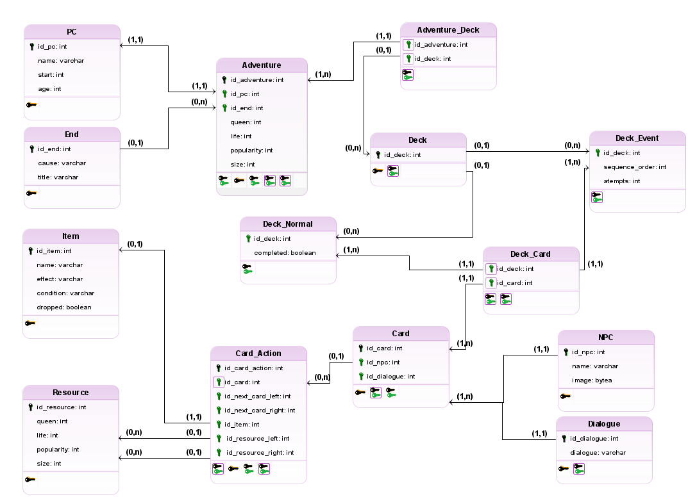

# **Modelo Relacional (MREL)**

## Introdução
O **Modelo Relacional (MREL)** é uma representação de um banco de dados que descreve a estrutura das tabelas, os campos e as relações entre elas. Ele é uma forma de organizar as informações de forma lógica e coerente, facilitando o armazenamento e a recuperação dos dados.

O MREL é composto por tabelas, que representam as entidades do sistema, e colunas, que representam os atributos dessas entidades. Cada tabela é representada por um nome e uma lista de colunas, e cada coluna é representada por um nome e um tipo de dado.

## Modelo Relacional

Fonte: [Kauan Eiras](https://github.com/kauaneiras), desenvolvido no [BRModelo](https://www.sis4.com/brModelo/)

## Histórico de Versão
| Data |	Versão	| Descrição	| Autor |
| --- | --- | --- | --- |
| 22/07/24 |	1.0 |	Criação do documento| [Kauan Eiras](https://github.com/kauaneiras)