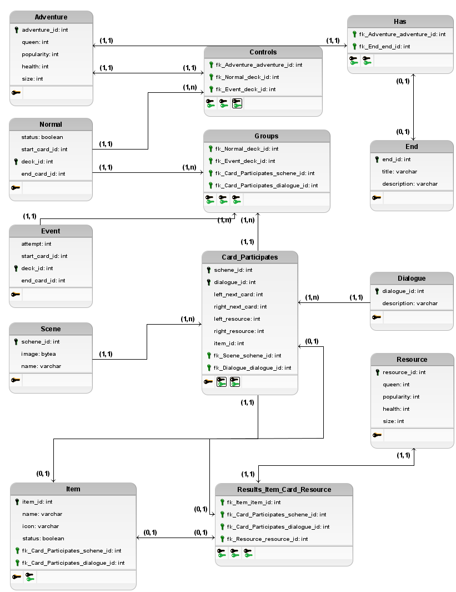

# **Modelo Relacional (MREL)**

## **Introdução**
O **Modelo Relacional (MREL)** é uma abordagem fundamental para a organização de dados em um banco de dados, onde as informações são estruturadas em tabelas inter-relacionadas. Cada tabela no modelo relacional representa uma entidade do sistema, e cada coluna dentro dessas tabelas corresponde a um atributo específico dessa entidade. 

O MREL facilita o armazenamento eficiente e a recuperação precisa dos dados, proporcionando uma base lógica e coerente para a manipulação das informações. As relações entre as tabelas são estabelecidas através de chaves primárias e estrangeiras, que asseguram a integridade e a consistência dos dados ao longo do sistema. Esse modelo permite que as complexidades do domínio sejam mapeadas de maneira organizada, garantindo que as operações de inserção, atualização, exclusão e consulta sejam realizadas de forma eficiente.

## **Modelo Relacional**

Fonte: [Kauan Eiras](https://github.com/kauaneiras), desenvolvido no [BRModelo](https://www.sis4.com/brModelo/)

## **Histórico de Versão**
| Data      | Versão | Descrição              | Autor                                        |
|-----------|--------|------------------------|----------------------------------------------|
| 22/07/24  | 1.0    | Criação do documento    | [Kauan Eiras](https://github.com/kauaneiras) |
| 19/08/24  | 2.0    | Revisão e atualização de entidades e relacionamentos    | [Kauan Eiras](https://github.com/kauaneiras) |