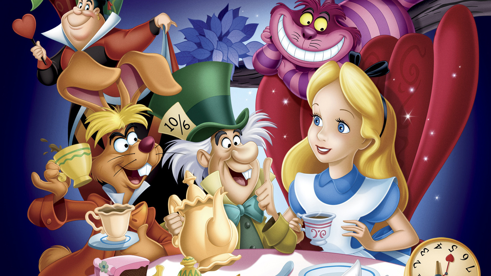

# **Reigns no País das Maravilhas**

**Reigns no País das Maravilhas** é um jogo de escolhas binárias inspirado no livro e série de Alice no País das Maravilhas, utilizando a mecânica simples e viciante do jogo Reigns. Neste jogo, você assume o Perjonagem Jogador que caiu na toca do coelho, e então toma decisões que afetam sua jornada pelo País das Maravilhas. 

## Inspiração

Este projeto é inspirado no estilo de jogo **Reigns**, onde decisões simples de deslizar para a direita ou esquerda levam a diferentes desdobramentos na história. A rica narrativa e o vasto universo de **Alice no País das Maravilhas** fornecem o pano de fundo perfeito para um jogo de escolhas, onde cada decisão pode levar a aventuras épicas, lutas intensas e encontros com personagens icônicos.

## Temática

O jogo mergulha você no mundo de Alice no País das Maravilhas, onde você pode:
- Conhecer personagens icônicos do livro.
- Explorar locais misteriosos e encontrar itens valiosos.
- Enfrentar desafios e inimigos formidáveis.
- Consumir poções mágicas e ganhar poderes incríveis.
- Gerenciar recursos, manter a lealdade de seus aliados e sobreviver a doenças.
- Encontrar o caminho de volta para casa.
- Descobrir os segredos do País das Maravilhas.
- Encontrar o coelho branco.
- Encontrar a rainha de copas.
- Encontrar o chapeleiro maluco.
- Encontrar o gato de cheshire.
- Encontrar a lagarta azul.
- Encontrar o rato.
- Encontrar o grifo.
- Encontrar a tartaruga falsa.

## Instruções de Jogo

1. **Início**: O jogo começa com você no controle de um Personagem Jogador que caiu na toca do coelho. Você deve tomar decisões que afetarão sua popularidade, saúde, tamanho e o coração da rainha de copas.
2. **Decisões**: Cada carta apresenta uma situação ou evento. Deslize para a esquerda ou direita para escolher uma ação. Suas escolhas terão consequências positivas ou negativas nos atributos do Personagem Jogador e da rainha de copas.
3. **Gestão**: Gerencie seus recursos com sabedoria. Mantenha a popularidade da rainha de copas alta, cuide da sua saúde e acumule tesouros para prosperar.
4. **Exploração**: Viaje para diferentes locais, enfrente desafios e lute contra inimigos. Cada nova localização pode trazer riquezas ou perigos.
5. **Progresso**: Avance na história enfrentando eventos e desafios que testarão suas habilidades de liderança e estratégia.
6. **Final**: Encontre o caminho de volta para casa ou morra no País das Maravilhas.
   
## Contato

Para dúvidas ou sugestões, entre em contato pelo e-mail: [232014727@aluno.unb.br](mailto:232014727@aluno.unb.br)

## Autor
   

<a href="https://github.com/kauaneiras"> <b>Kauan Eiras</b></a> 

## Histórico de Versões

| Versão | Data       | Descrição                    | Autor(es)                               | 
| ------ | ---------- | ---------------------------- | --------------------------------------- | 
| 1.0    | 14/07/2024 | Criação do Pages             | [Kauan T. Eiras](https://github.com/kauaneiras) |

